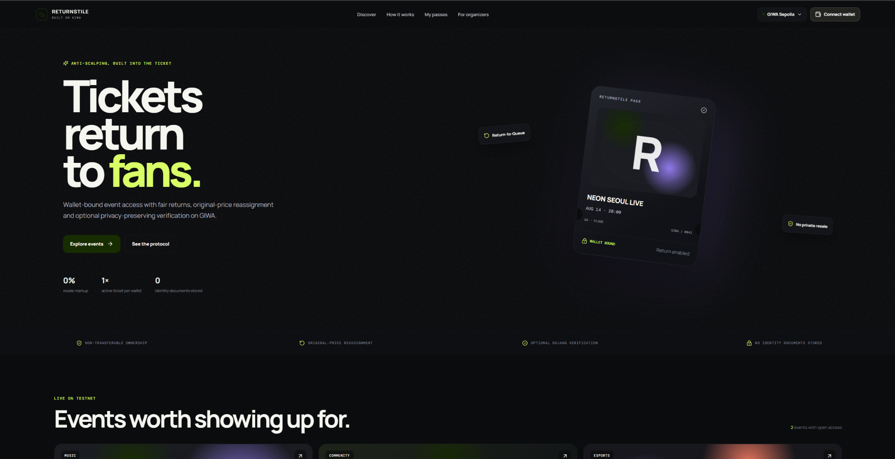

# Returnstile





**Tickets return to fans, not resellers.**

Returnstile is a privacy-preserving anti-scalping event protocol designed for GIWA. Tickets are wallet-bound and cannot be privately transferred. When a holder cannot attend, the ticket is returned to the protocol, the holder receives refundable credit, and the seat is offered to the next eligible wallet at the original price.

## Why GIWA

Returnstile uses GIWA where it adds real product value:

- **GIWA Sepolia:** low-cost, EVM-compatible settlement and fast confirmations.
- **Optional Dojang verification:** organizers can create high-demand events that require an existing Verified Address attestation.
- **No identity uploads:** Returnstile never asks for or stores passports, ID cards, selfies, legal names, phone numbers, or addresses.
- **Wallet-ready UX:** users see simple actions—buy, join waitlist, return and show entry code—rather than NFT or calldata terminology.

## Core mechanism: Return-to-Queue

1. A wallet claims one active, non-transferable ticket.
2. If the holder cannot attend, the ticket is returned before the deadline.
3. Refund credit is assigned to the holder.
4. The released seat is offered to the first wallet in the FIFO waitlist.
5. The next wallet claims at the original face value.
6. Entry uses a short-lived wallet signature and can only be checked in once.

## Privacy model

The protocol stores only:

- wallet addresses;
- event and ticket identifiers;
- ticket status;
- payment/refund amounts;
- optional Dojang verification checks;
- check-in state.

It does **not** store identity documents or personal information.

## Network configuration

| Item | Value |
| --- | --- |
| Network | GIWA Sepolia |
| Chain ID | `91342` |
| RPC | `https://sepolia-rpc.giwa.io` |
| Explorer | `https://sepolia-explorer.giwa.io` |
| DojangScroll | `0xd5077b67dcb56caC8b270C7788FC3E6ee03F17B9` |
| Upbit Korea attester ID | `0xd99b42e778498aa3c9c1f6a012359130252780511687a35982e8e52735453034` |

The public RPC is rate-limited and should be replaced with a production provider before mainnet use.

## Run the frontend

```bash
npm install
npm run dev
```

The first build includes a polished interactive demo and real GIWA wallet/network connection. Contract writes are intentionally kept in demo mode until a deployed address is supplied.

## Compile and test contracts

```bash
npm run contract:compile
npm run contract:test
```

## Deploy to GIWA Sepolia

1. Copy `.env.example` to `.env`.
2. Add a burner-wallet private key funded with GIWA Sepolia ETH.
3. Run:

```bash
npm run contract:deploy:giwa
```

Never commit the `.env` file or use a primary wallet.

## MVP contract protections

- one active ticket per wallet per event;
- optional Dojang verification gate;
- non-transferable ticket ownership;
- fixed original price;
- FIFO waitlist;
- expiring queue offers;
- pull-based refunds;
- reentrancy protection;
- return deadline enforcement;
- signed, single-use check-in;
- organizer proceeds locked until the return window closes.

## Product roadmap

- connect frontend writes to the deployed contract;
- organizer event creation studio;
- signed QR generation and camera scanner;
- event metadata on IPFS with hash commitment onchain;
- Korean localization;
- GIWA Wallet embeddable Pass component;
- production RPC and monitoring.

## Positioning

> Returnstile is not an NFT marketplace. It is a fair-access ticket lifecycle where tickets can only return to the official queue and prices cannot rise.
